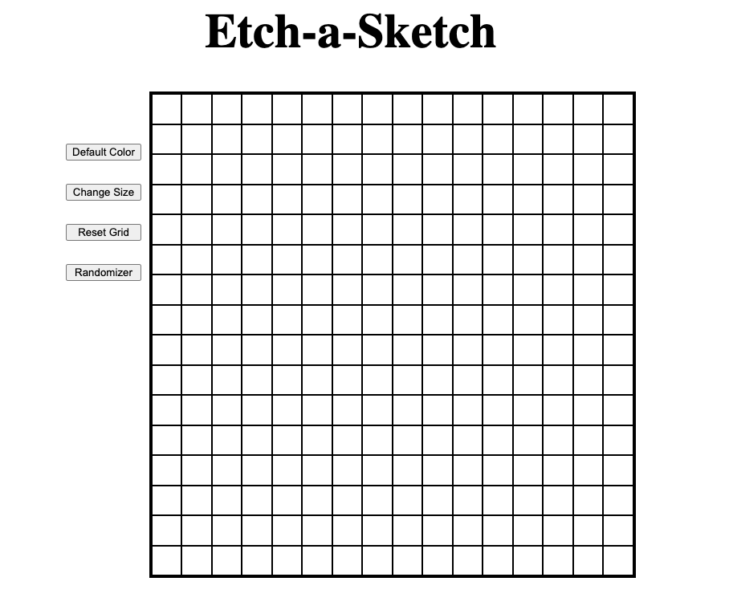

# Etch-a-Sketch

https://jyfoil.github.io/Etch-a-Sketch/

## Project Description

This is a simple Etch-a-Sketch project that allows the user to draw pixels over a canvas. Project was created using JavaScript, HTML, and CSS. Some features in this project include:

- A button to change the grid size
- A reset button to clear the sketchpad
- A randomizer button that randomly selects a color each hover
- A button to return to the default color (black)

### Future Implementations

- Better styling (theme)
- Draw on left click hold
- Color picker
- Size slider

## Iterations

7/16/2022

## Reflection

The initial challenges in this project had to do with creating the first 16x16 grid. Flexbox was used but eventually CSS grid was decided to be better suited for the project. I had trouble scaling the grid when changing sizes as it would overflow the container. Eventually using DOM manipulation by having the number of squares per row scale depending on the grid size fixed this problem. From there it was just about selecting buttons using the DOM and adding event listeners to them to allow functionality.
